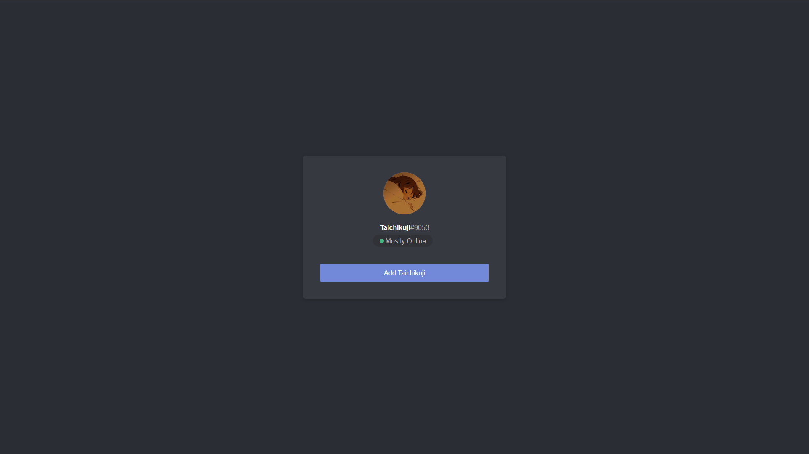

# Template - Discord themed introduction profile.
This is a template of an Introduction site i made myself with Discord in mind.

It uses the almost identical css assets from the site, and it's made so you only have to edit the information inside and use it at your own will!

This is a static site with no php behind (but will thought how to add in the future) so you don't have to worry, you can easily implement it with GitHub pages, your personal nginx server or your prefered hosting service!




If you want to change anything, i'll let you know where and what do you need to do.
## Head and metadata
First of all, you need to go to the head and pay attention to the information i added on purpose so you don't have to worry too much about it.

```
    <meta name="viewport" content="width=device-width; height=device-height;">
    <!-- meta info -->
    <meta http-equiv="Content-Type" content="text/html; charset=UTF-8">
    <meta name="description" content="Template for a discord profile, made by Taichikuji!">
    <meta name="viewport" content="user-scalable=no, width=device-width" />
	<link rel="icon" href="pfp/profilepicture.webp">
    <link rel="stylesheet" href="main.css">
    
 <title>Taichikuji's Profile!</title>
```

Here we can see that we have ``<link rel="icon" href="pfp/profilepicture.webp">`` which you will need to change to whatever you want (if you change this, make sure to know what are you doing). By default you will have the profile picture that is located inside the folder, but you can change it to your own icon or image.
### Twitter
```
    <!-- twitter meta info -->
    <meta name="twitter:card" content="summary" />
    <meta name="twitter:site" content="@taichikuji" />
    <meta name="twitter:title" content="User's Discord!" />
    <meta name="twitter:description" content="Template for a discord profile, made by Taichikuji!" />
    <meta name="twitter:creator" content="@taichikuji" />

    <meta name="twitter:image" content="pfp/profilepicture.webp">
    <!-- Here you can input whatever picture you want to properly show on twitter. by default it will display the profile picture to avoid any bugs. -->
    <meta name="twitter:image:alt" content="This is displaying because somehow this image is missing.">

```

Here we will have multiple things that we will need to change, but i added some comments to help you understand. Most important line is probably ``<title>Taichikuji's Profile!</title>``, the rest will only matter if you want to plug it on twitter, otherwise you can even remove it.
### Discord
```
<!--discord meta info -->
    <meta property="og:title" content="Template for a discord profile, made by Taichikuji!" />
    <meta property="og:type" content="website" />
    <meta property="og:url" content="https://github.com/taichikuji/template-discord-introduction/" />
    <meta property="og:image" content="pfp/profilepicture.webp" />
    <!-- Once again, here you can input whatever picture you want to properly show on Discord. by default it will display the profile picture to avoid any bugs. -->
    <meta property="og:description" content="This is displaying because somehow this image is missing." />
```

Same goes for discord's metadata, but this one is kinda more important since the whole theme is about discord, so you might have a better chance plugging it on your servers. :P

## Body and HTML content

After all of this, here it comes the important part. You want to edit what you will actually see after having it online and running. You need to go to ``<span class="username headerTagUsernameNoNickname-2_H881 weightSemiBold-NJexzi">Username_Template</span><span class="discriminator">#0001</span>`` And change the information inside, finding "Username_Template" and "#0001" to the values you're currently using.

You will also want to modify this part of the file ``<div class="contents-18-Yxp">Add Username_Template</div>`` with, again, the name you currently have on Discord or another value you consider important. I personally made it as a "Send me to discord" button to make it easier for people that visit my site to actually add me.

You can also change the background easily by changing the values of the css file from ``background:#2a2d33`` to another value if you only want to change the color, or change the whole thing to ``background-image:url(&quot;pfp/taichiprofile.webp&quot;);"``

Other than that, there's not much else to do! If you did things properly, you will have your own introduction to your Discord up and running, also looking shiny!
